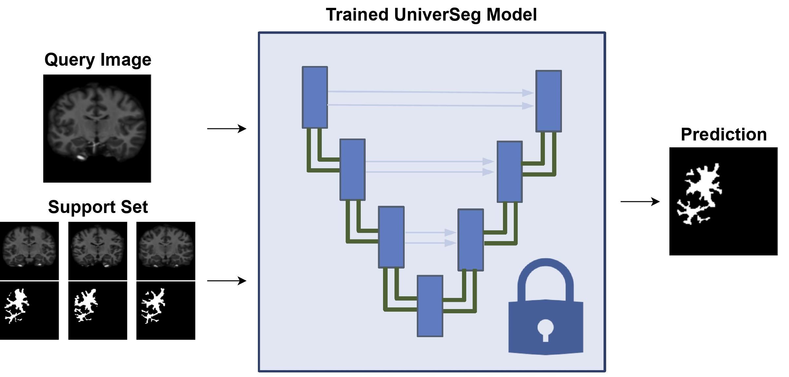

# Simple-UniverSeg
Course Project For ENG EC 500 - Biomedical Images for AI

# Task
To train a simpler variant of UniverSeg, which trains on several labels of 24 seg-protocol of 2D brain MRI and generalize to holdout labels.

# Pre-trained UniverSeg Model
The pre-trained UniverSeg model is described at project/models/original_universeg/model.py

# Evaluation Script (project/main.py)
This script evaluates the pre-trained UniverSeg model on [Neurite OASIS Sample Data](https://github.com/adalca/medical-datasets/blob/master/neurite-oasis.md) with 24 seg protocol.

# Utilities scripts (project/utils folder)
- dataset.py: Loads the Neurite OASIS data.
- visualization.py: For visualizing the Original Image, Ground truths, Soft Predictions and Predictions

# Plots for visualization (project/Plots)
- choose_labels.ipynb - Comparison of size of different ROIs in the Brain MRI images
- plot_selected_labels.ipynb - Highlight the labels to get an idea of the various categories of labelled data

# Licenses
Code is released under the [Apache 2.0 license](LICENSE).

\subsection{Code Details}

% \textbf{dataset.py} and \textbf{visualization.py} -- 
% The code has been modified from the following sources:
% \begin{itemize}
%   \item \url{https://github.com/JJGO/UniverSeg/blob/main/example_data/oasis.py} for processing the OASIS dataset.
%   \item OASIS dataset processing details available at \url{https://github.com/adalca/medical-datasets/blob/master/neurite-oasis.md}.
% \end{itemize}
% \textbf{main.py} -- 
% The inference pipeline has been adapted from \url{https://colab.research.google.com/drive/1TiNAgCehFdyHMJsS90V9ygUw0rLXdW0r?usp=sharing}.
% \textbf{Additional Code:}
% \begin{itemize}
%   \item \textbf{main.py}: Enhanced with Dice Score and HD95 evaluation metric.
%   \item \textbf{choose\_labels.ipynb}: Provides a comparison of the sizes of different Regions of Interest (ROIs) in Brain MRI images.
%   \item \textbf{plot\_selected\_labels.ipynb}: Highlights labels to provide an overview of the various categories of labeled data.
% \end{itemize}
